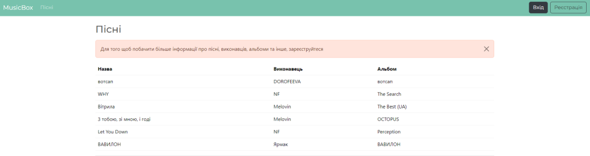

# APIWebApp

A simple ASP.NET Core Web API for managing books, authors, genres, categories, and publishers.  
Designed to demonstrate RESTful API design with Entity Framework Core and SQL database integration.

## Features
- **CRUD operations** for:
  - Authors
  - Books
  - Categories
  - Genres
  - Publishers
- **Query genres by author**  
- **Many-to-many relationship** between books and publishers  
- Validations and error handling for API requests  
- JSON-based request and response format  

## Technologies
- ASP.NET Core 7  
- Entity Framework Core  
- SQL Database (e.g., SQL Server, SQLite)  
- RESTful API principles  

## Getting Started

### Prerequisites
- .NET 7 SDK  
- SQL Server / SQLite

